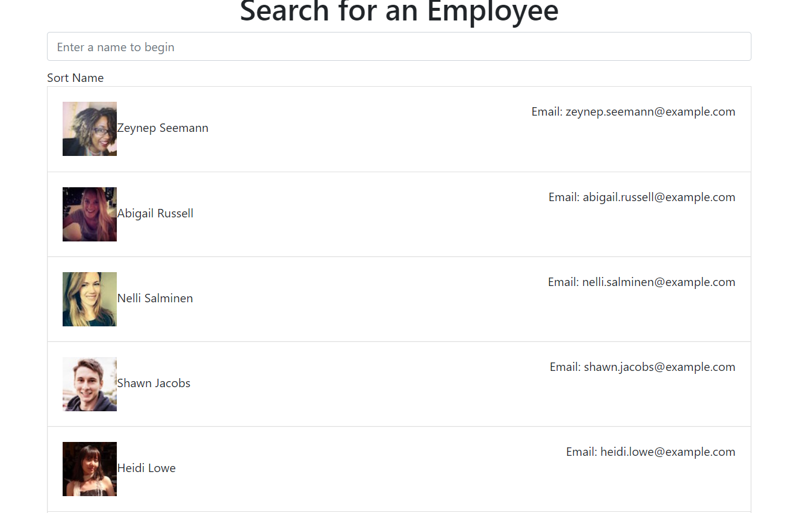

# React-Employee-Directory

This appliation uses React to provide a employee directory in which the user can search or filter by name. This project was created primarily to demonstrate my knowledge in React.

## Motivation
This project was developed to utilize React.

## Deployed Application

[Click Here](https://liambambery23.github.io/React-Employee-Directory/)

 
## Screenshots

## Tech/framework used
Bootstrap
Randomuser.me API

## Installation
If you wish to run this application locally, you can clone the repository. Once the repo is clones, you can run 'npm start' in the command line and the application will run on localhost:3000.

## How to use?
You can either use the search bar to dynamically search the users or you can sort their names in alphabetical order.

## Contribute

If you would like to contribute to this project or have any questions please feel free to email me. 

[Repository](https://github.com/liambambery23/React-Employee-Directory)

Liambambery23@gmail.com
 

#### Anything else that seems useful

## License

MIT © [Liam Bambery](http://liambambery.com)